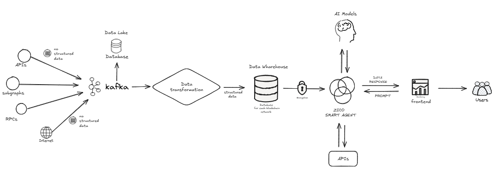
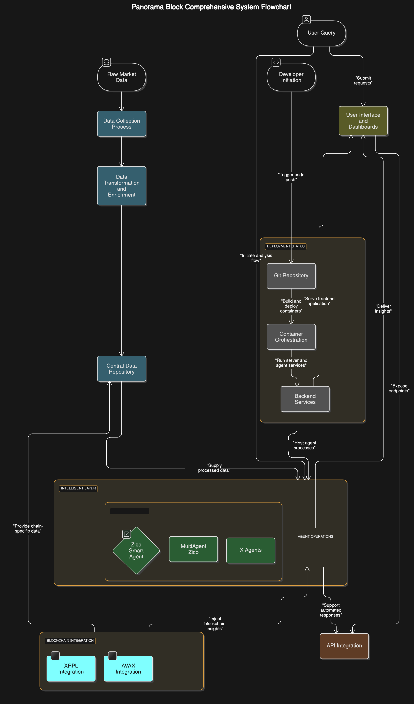

# PanoramaBlock Technical Documentation

**[Panorama Website](https://panoramablock.com/)**
**[Panorama Orignal Documentation](https://docs.panoramablock.com/)**

## Overview
PanoramaBlock is designed to transform raw crypto market data into structured, actionable insights. It operates as an ecosystem that seamlessly collects, processes, and distributes data, enabling users and systems to interact with relevant information in real-time with high reliability. By integrating multiple data sources and structuring them effectively, our intelligent agents provide insights, optimize DeFi strategies, and automate on-chain processes.

---

## **Technical Architecture**
### **1. Data Collection Layer**
The system starts by collecting raw data from multiple sources:
- **APIs**: External market data providers such as CoinGecko, Coinbase, and blockchain explorers.
- **Subgraphs**: GraphQL-based indexing of blockchain data.
- **RPCs**: Direct interaction with blockchain nodes for real-time data retrieval.
- **Internet Scraping**: AI-based analysis of market trends, news, and community sentiment.

Each data source feeds structured or unstructured data into **Apache Kafka**, ensuring high-throughput ingestion and real-time processing capabilities.

### **2. Data Processing and Storage**
Once ingested, the raw data is transformed:
- **Data Transformation**: Standardizes and enriches data with metadata and quality checks.
- **Data Storage**:
  - **Data Lake**: Stores raw blockchain data for historical analysis.
  - **Data Warehouse**: Optimized for fast queries and structured analytics, using tools such as **ClickHouse**.
- **Encryption and Security**: Sensitive data is secured using asymmetric cryptography before storage.

### **3. AI & Intelligent Agents**
The AI system utilizes a multi-agent approach:
- **ZICO Smart Agent**: The primary AI engine that:
  - Monitors significant transactions and whale movements.
  - Automates DeFi transactions and swaps.
  - Performs predictive market analysis using real-time data.
- **Multi-Agent System**: Includes specialized agents for different blockchains and financial strategies.
- **API Integrations**: Facilitates seamless interaction with external services.

### **4. User Interaction and Distribution**
- **Frontend Interface**: A **Next.js-based dashboard** provides visual analytics and insights.
- **APIs**: Developers can interact with the platform via API endpoints.
- **Automated Alerts & Reports**: Users receive AI-generated notifications based on market movements.

---
### System Flow:

---

## **ZICO Main Agent Documentation**

### **Introduction**
The ZICO Main Agent is the AI-powered component of PanoramaBlock, designed to streamline blockchain data analysis, automate DeFi strategies, and provide actionable insights.

### **Key Features**
- **Data Acquisition & Standardization**: Connects to PanoramaBlock’s proprietary data sources for seamless blockchain data ingestion.
- **DeFi Automation**: Supports gasless transactions, DCA strategies, and smart contract interactions.
- **AI-Powered Insights**: Generates market trend reports, analyzes whale activities, and predicts liquidity shifts.
- **API Integration**: Fetches live market data from CoinGecko, XRPL, and other external sources.

### **Core Functionalities**
1. **Image Generation**
   - Processes AI-generated images based on crypto-related prompts.
2. **Gasless USDC Transactions**
   - Executes fee-free transfers on supported networks.
3. **Automated DeFi Strategies**
   - Configures and manages recurring investments and DCA plans.
4. **Crypto Market Analysis**
   - Retrieves and processes live market data.
5. **Social Media Content Creation**
   - Generates tweets and insights for AI-driven engagement.
6. **PDF & Document Analysis**
   - Supports blockchain whitepaper summarization and document parsing.

### **Architecture Overview**
- **Docker-based Deployment**: Each agent runs in a dedicated container for modular scaling.
- **AI Model Integration**: Uses NLP and machine learning for predictive analysis.
- **Secure Transactions**: All on-chain interactions adhere to strict security protocols.
---

## PanoramaBlock Repositories
Below is an overview of the main repositories in the PanoramaBlock ecosystem. Instructions to run each repository are available in their respective `README.md` files.

### 1. **[Zico Agents](https://github.com/Panorama-Block/zico_agents)**
Responsible for implementing multiple intelligent agents within the ecosystem.
- Natural Language Processing (NLP) for chatbot interactions.
- Automated execution of DeFi strategies and transactions.
- On-chain and off-chain data extraction for analysis.
- Generation of reports and insights for investors.

### 2. **[Panorama Features](https://github.com/Panorama-Block/panorama-block-backend)**
Backend responsible for connecting to APIs and integrating core functionalities.
- Wallet tracking capabilities.
- Integration with liquidity swap platforms.
- Connection with external services for blockchain data retrieval.

### 3. **[X-Scrape](https://github.com/Panorama-Block/x-scrape)**
Handles data extraction from Twitter to feed AI models and dashboards.
- Monitors crypto influencers and hashtags.
- Generates automatic reports on market trends.
- Provides data for AI-powered reports.

### 4. **[Frontend](https://github.com/Panorama-Block/dashboard)**
Graphical interface for data visualization and agent interaction.
- Interactive dashboards for blockchain transaction monitoring.
- Real-time visualization of liquidity, TVL, and on-chain activities.
- Integration with AI agents for executing commands.

### 5. **[ETL System](https://github.com/Panorama-Block/etl)**
Infrastructure for Extract, Transform, and Load (ETL) processes.
- Collects blockchain and on-chain service data.
- Real-time processing using Apache Kafka and Spark.
- Structured data storage for analytics and dashboards.

### 6. **[Report and X Agent](https://github.com/Panorama-Block/x-api), [Agents](https://github.com/Panorama-Block/agents)**
Responsible for automated reporting and Twitter-based AI agents.
- Generates daily reports on blockchain events.
- Monitors social media trends to feed AI models.
- Facilitates automated interactions through AI agents.

### 7. **Networks Data Collection**
[XRPL](https://github.com/Panorama-Block/xrpl-data-extraction)
[AVAX](https://github.com/Panorama-Block/avax-data-extraction)
[STACKS](https://github.com/Panorama-Block/stacks-data-extraction)
[BITCOIN](https://github.com/Panorama-Block/bitcoin-data-extraction)

Data extraction infrastructure for different networks.
- Monitors transactions, blocks, accounts and key network metrics.
- Collects liquidity and wallets activity data.

### 8. **[PanoramaBlock Monorepository](https://github.com/Panorama-Block/panorama-block)**
The initial monolithic repository of PanoramaBlock.
- Contains original implementations of core PanoramaBlock services.
- Centralized functionalities before they were modularized.
- Maintains the historical versions of the project.

---

## **Conclusion**
PanoramaBlock provides a scalable, AI-powered blockchain analytics ecosystem. By integrating data collection, transformation, intelligent agents, and user interfaces, it simplifies the complexity of interacting with blockchain data. Our AI-driven insights and automation pave the way for a more transparent and efficient crypto ecosystem.

For more details on how to run each repository, refer to their respective `README.md` files.

